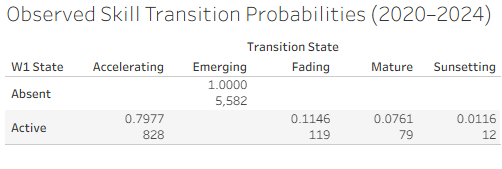

# Data & IT Labour Market Dynamics (2015–2024)

Empirical end-to-end analysis of Data & IT skill demand dynamics (2015–2024) using Python, SQL, and Tableau, incorporating post-2020 structural break analysis, long-tail depth, non-predictive scenario framing (2025–2027), and empirically observed transition probabilities between post-2020 windows.

## Highlights

- **Observed transition probabilities (W1→W2):** Empirical transition matrix quantifies how skills move between regimes (Emerging, Accelerating, Mature, Fading, Sunsetting) between 2020–2022 and 2022–2024, validated directly in SQL.
- **Post-2020 structural break:** The analysis explicitly isolates post-2020 dynamics, revealing a highly asymmetric skill landscape dominated by emerging and accelerating skills.
- **Non-predictive scenarios (2025–2027):** Forward-looking scenarios are framed descriptively, grounded in observed post-2020 behaviour rather than forecasting or extrapolation.

## Key Visuals

### Observed Transition Matrix

### Transition Probability Heatmap

